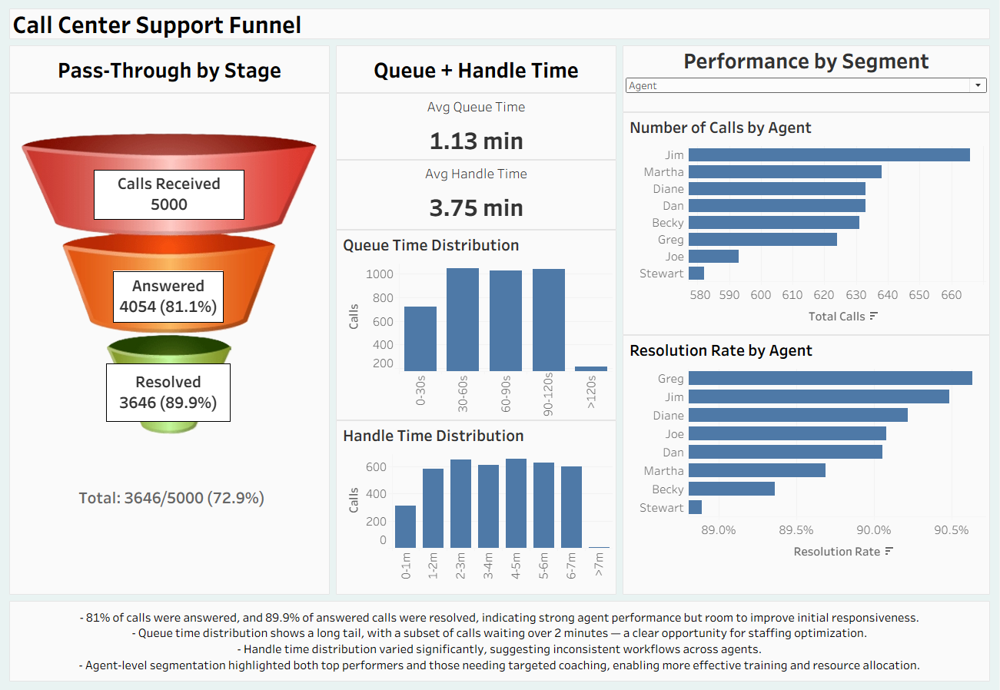

# Call Center Support Funnel

## Executive Summary

A national call center operation was experiencing inconsistent service levels and lacked visibility into where calls were getting stuck in the support process. Using SQL and Tableau, I built a full funnel analysis to understand call flow, agent performance, and operational bottlenecks. The resulting dashboard provides a clear, real time view of how calls progress from receipt to resolution, enabling leaders to diagnose issues quickly and improve customer experience.
  
Based on the analysis, I recommend the following actions to improve efficiency and service quality:
1.	Reduce queue time variability by identifying peak load patterns and adjusting staffing accordingly.
2.	Target coaching for agents with lower resolution rates to improve consistency across the team.
3.	Use handle time distribution insights to refine training and standardize best practices.
4.	Monitor funnel pass through rates to detect emerging operational issues before they impact customers.

## Business Problem

The call center needed a structured way to understand:
- Where calls were dropping off in the support process
- How long customers were waiting before reaching an agent
- How efficiently agents were resolving issues
- Which agents or segments were driving performance variation

Without a unified view, leaders were making decisions based on anecdotal feedback rather than data. The goal was to build a clear, actionable dashboard that visualizes the entire support funnel and highlights opportunities for operational improvement.

## Methodology 

1. 	SQL Data Extraction & Cleaning
- Pulled call‑level data including timestamps, queue durations, handle times, and resolution outcomes.
- Cleaned and transformed the dataset to create stage‑level metrics for funnel analysis.

2. 	Metric Engineering
- Calculated pass‑through rates, queue time buckets, handle time buckets, and agent‑level KPIs.
- Ensured handle time included all answered calls to accurately reflect workload.

3. 	Tableau Dashboard Development
- Designed a multi‑section dashboard including funnel visualization, time distributions, and agent performance.
- Applied UI/UX best practices: text hierarchy, card layout, accent lines, and consistent spacing.
- Built filters and interactivity to allow leaders to drill into agent‑level performance.

## Skills

SQL: Date/time transformations, CASE logic, aggregations, data cleaning, binary category formatting

Tableau: Calculated fields, LOD expressions, dashboard design, KPI cards, funnel charts, distribution charts, bin value creation

Analytics: Funnel analysis, performance diagnostics, segmentation, operational insights

Data Visualization: Layout design, color theory, hierarchy, user‑centric dashboarding

## Results and Business Recommendation

  The analysis revealed several key insights:
- 81% of calls were answered, and 89.9% of answered calls were resolved, indicating strong agent performance but room to improve initial responsiveness.
- Queue time distribution showed a long tail, with a subset of calls waiting over 2 minutes — a clear opportunity for staffing optimization.
- Handle time distribution varied significantly, suggesting inconsistent workflows across agents.
- Agent‑level segmentation highlighted both top performers and those needing targeted coaching, enabling more effective training and resource allocation.

### Recommendations
1. 	Optimize staffing during peak queue periods to reduce wait times and improve customer satisfaction.
2. 	Standardize best practices from top‑performing agents to reduce handle time variability.
3. 	Use resolution‑rate insights to guide coaching and performance management.
4. 	Monitor funnel pass‑through rates weekly to detect operational issues early.

## Next Steps

1. 	Integrate customer satisfaction (CSAT) data to connect operational performance with customer outcomes.
2. 	Add call reason categorization to identify which issue types drive the longest handle times. This could also involve customer-facing error codes for more fluid communication.
3. 	Develop predictive models for call volume forecasting and staffing optimization.
4. 	Automate data refresh to support real‑time monitoring.

Dataset Link: [https://www.kaggle.com/datasets/ashishpandey5210/call-center-dataset/data](https://www.kaggle.com/datasets/ashishpandey5210/call-center-dataset/data)
